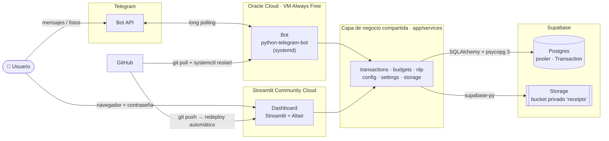

# Finanzas_Gestor

**Gestor financiero personal operado desde Telegram, con dashboard web y
desplegado 24/7 en la nube a costo cero.**

Registrar un gasto es tan simple como escribirle al bot *"gasté 35 en
almuerzo"* o mandarle la foto del comprobante. Todo queda en una base de
datos Postgres, y un dashboard web muestra en qué se va el dinero, cómo va
cada presupuesto del mes y la galería de comprobantes.


---

## ¿Qué hace?

| | Funcionalidad |
|---|---|
| 💬 | **Registro por lenguaje natural** — "gasté 35 en almuerzo ayer" → monto, categoría, subcategoría y fecha, sin IA (parser determinístico). |
| 📸 | **Registro con foto de comprobante** — la foto se guarda en un bucket privado y queda enlazada al movimiento. |
| 🧭 | **Flujo guiado con botones** (`/gasto`) — tipo → categoría → subcategoría → monto → confirmar. |
| 📊 | **Presupuestos por categoría y subcategoría** con alertas por umbral (aviso / alerta / excedido) e historial que nunca reescribe meses pasados. |
| 📈 | **Dashboard web** — KPIs, gasto por categoría, fijo vs. variable, evolución en el tiempo, galería de comprobantes. |
| ⚙️ | **Todo configurable sin tocar código** — categorías, presupuestos, métodos de pago, ingreso mensual y umbrales viven en la base de datos. |
| 🔒 | **Bot restringido a chats autorizados**, dashboard protegido con contraseña, bucket de fotos privado, base de datos con rol de mínimo privilegio y RLS. |

## Arquitectura en un vistazo



Dos procesos independientes (bot y dashboard) en proveedores distintos que
comparten **la misma capa de servicios** y **la misma base de datos**: un
gasto registrado por Telegram aparece en el dashboard al instante, y un
presupuesto editado en el dashboard lo usa el bot en el siguiente mensaje.

## Stack tecnológico

| Capa | Tecnología | Por qué |
|---|---|---|
| Lógica de negocio | Python + SQLAlchemy 2.0 (tipado declarativo) | Independiente de la interfaz; testeable sin red |
| Base de datos | Supabase Postgres (prod) · SQLite (dev/tests) | `DATABASE_URL` cambia el motor sin tocar código |
| Archivos | Supabase Storage (bucket privado + URLs firmadas) | Bot y dashboard no comparten disco |
| Bot | `python-telegram-bot` v21, modo *polling* | Sin dominio, sin HTTPS, sin puertos de entrada |
| Hosting del bot | Oracle Cloud Always Free (ARM Ampere A1) + `systemd` | 24/7, reinicio automático, S/0 |
| Dashboard | Streamlit + Altair + pandas en Streamlit Community Cloud | Redeploy automático en cada `git push` |
| Lenguaje natural | Regex + diccionario de palabras clave | Gratis, instantáneo y 100 % predecible |
| Tests | pytest sobre SQLite en memoria | 42 tests, sin token, sin internet, sin Supabase |

## Documentación

| Documento | Contenido |
|---|---|
| 📘 [**Análisis técnico**](docs/ANALISIS_TECNICO.md) | Objetivos, arquitectura, modelo de datos (ER), flujos del bot (diagramas de secuencia y estados), algoritmos de presupuesto, decisiones de diseño, seguridad, retos técnicos resueltos y roadmap. |
| 🚀 [**Guía de despliegue**](docs/DESPLIEGUE.md) | Paso a paso para reproducir el despliegue completo: Supabase, Oracle Cloud + `systemd`, Streamlit Community Cloud. |
| 🎨 [`preview/dashboard.html`](preview/dashboard.html) | Mockup visual del dashboard con datos de ejemplo (se abre directo en el navegador). |

## Estructura del proyecto

```
app/
├── config.py              # configuración desde variables de entorno
├── db.py                  # motor SQLAlchemy, sesión y migraciones ligeras
├── models.py              # esquema completo (10 tablas)
├── services/              # lógica de negocio pura (sin Telegram ni Streamlit)
│   ├── transactions.py    #   alta y consulta de movimientos
│   ├── budgets.py         #   presupuesto vs. gastado, umbrales, prorrateo
│   ├── config.py          #   CRUD de categorías, subcategorías, métodos, presupuestos
│   ├── settings.py        #   ajustes clave-valor (ingreso, umbrales)
│   ├── nlp.py             #   parser de lenguaje natural
│   ├── storage.py         #   fotos en Supabase Storage
│   ├── users.py           #   chat de Telegram → usuario
│   └── seed.py            #   datos iniciales
├── bot/
│   ├── main.py            # arma la Application y registra handlers
│   ├── access.py          # lista blanca de chats (ALLOWED_CHAT_IDS)
│   ├── formatting.py
│   └── handlers/          # /gasto, texto libre, fotos, /presupuesto, /resumen
└── webapp/
    └── config_app.py      # dashboard + panel de configuración (Streamlit)
tests/                     # 42 tests (pytest)
deploy/finanzas-bot.service  # unidad systemd de referencia para el bot
docs/                      # análisis técnico y guía de despliegue
preview/dashboard.html     # mockup visual
```

## Correrlo en local

Requiere Python 3.10+. En desarrollo usa SQLite: no hace falta ninguna
cuenta externa salvo un bot de Telegram propio.

```bash
python -m venv .venv
.venv\Scripts\activate            # Windows  (Linux/macOS: source .venv/bin/activate)
pip install -r requirements.txt

cp .env.example .env              # completar TELEGRAM_BOT_TOKEN y DASHBOARD_PASSWORD

python -m app.services.seed       # crea finanzas.db con datos iniciales
python -m pytest                  # 42 tests

python -m app.bot.main                    # bot
streamlit run app/webapp/config_app.py    # dashboard en http://localhost:8501
```

**Autorizar tu chat:** la primera vez, con `ALLOWED_CHAT_IDS` vacío, el bot
no registra nada y te responde con tu `chat_id`. Cópialo en `.env`
(`ALLOWED_CHAT_IDS=<tu_chat_id>`) y reinicia el bot. A partir de ahí, los
mensajes de cualquier otro chat se ignoran.

> Las fotos de comprobantes requieren `SUPABASE_URL` y
> `SUPABASE_SERVICE_ROLE_KEY`; el resto funciona sin Supabase.

## Usar este proyecto como base

El repositorio está pensado para que puedas montar **tu propio gestor**.
Haz un fork o descárgalo, crea tu propio bot con @BotFather y tus propias
cuentas gratuitas, y sigue la [guía de despliegue](docs/DESPLIEGUE.md).
Ningún dato ni credencial de este proyecto viaja con el código: cada
instancia usa su propia base de datos y solo responde a los chats de su
`ALLOWED_CHAT_IDS`.

Lo que conviene adaptar:

| Qué | Dónde |
|---|---|
| Categorías, subcategorías, presupuestos y métodos de pago iniciales | `app/services/seed.py` (después se editan desde el dashboard) |
| Palabras clave del registro por texto libre ("almuerzo" → Comida) | `_KEYWORDS` en `app/services/nlp.py`, deben coincidir con los nombres de tus categorías |
| Moneda | `DEFAULT_CURRENCY` en `.env`; los textos del bot y del parser asumen soles (`S/`) |
| Ingreso mensual inicial | `MONTHLY_INCOME` en `.env` (después se edita desde el dashboard) |
| Zona horaria (define qué es "hoy") | La del servidor: `timedatectl set-timezone` en la VM |

## Estado

✅ En producción y funcionando 24/7 (bot en Oracle Cloud, dashboard en
Streamlit Community Cloud, datos en Supabase), costo mensual **S/0**.

Próximos pasos: gastos recurrentes automáticos, comandos `/ahorro` e
`/inversion`, OCR del comprobante y migraciones versionadas con Alembic —
detalle en el [roadmap](docs/ANALISIS_TECNICO.md#12-limitaciones-y-roadmap).

## Licencia

[MIT](LICENSE): puedes usar, modificar y distribuir el código libremente,
manteniendo el aviso de copyright.
