# Análisis técnico — Finanzas_Gestor

> Documento de arquitectura y decisiones de diseño. Para instalar o
> desplegar el proyecto, ver el [README](../README.md) y la
> [guía de despliegue](DESPLIEGUE.md).

## Índice

1. [Contexto y objetivos](#1-contexto-y-objetivos)
2. [Requisitos](#2-requisitos)
3. [Arquitectura general](#3-arquitectura-general)
4. [Arquitectura en capas del código](#4-arquitectura-en-capas-del-código)
5. [Modelo de datos](#5-modelo-de-datos)
6. [Flujos del bot de Telegram](#6-flujos-del-bot-de-telegram)
7. [Lógica de negocio destacada](#7-lógica-de-negocio-destacada)
8. [Dashboard y panel de configuración](#8-dashboard-y-panel-de-configuración)
9. [Infraestructura y despliegue](#9-infraestructura-y-despliegue)
10. [Seguridad](#10-seguridad)
11. [Estrategia de testing](#11-estrategia-de-testing)
12. [Limitaciones y roadmap](#12-limitaciones-y-roadmap)
13. [Retos técnicos resueltos](#13-retos-técnicos-resueltos)
14. [Lecciones aprendidas](#14-lecciones-aprendidas)

---

## 1. Contexto y objetivos

El problema: llevar el control de gastos personales en una hoja de cálculo
falla por fricción — hay que abrirla, buscar la fila, escribir. Si registrar
un gasto cuesta más que 5 segundos, se deja de hacer.

La solución: mover el registro al lugar donde ya se está todo el día (el
chat) y dejar el análisis para una web.

| Objetivo | Cómo se cumple |
|---|---|
| Registro en segundos, desde el celular | Bot de Telegram con texto libre, fotos y botones |
| Visibilidad del presupuesto | Alertas por umbral en cada registro + dashboard web |
| Nada hardcodeado | Categorías, presupuestos, umbrales e ingreso viven en la BD |
| Disponible 24/7 sin PC encendida | Bot en VM en la nube + dashboard y BD gestionados |
| Costo **S/0** | Solo capas gratuitas: Oracle Always Free, Supabase Free, Streamlit Community Cloud |
| Preparado para crecer | `user_id` en todas las tablas, capa de servicios desacoplada de la interfaz |

## 2. Requisitos

**Funcionales**

- RF1 — Registrar gastos por texto libre, flujo guiado o foto de comprobante.
- RF2 — Clasificar cada gasto en categoría y subcategoría.
- RF3 — Presupuestos mensuales por categoría y por subcategoría, con historial.
- RF4 — Avisar al registrar un gasto cuánto se lleva del presupuesto del mes.
- RF5 — Dashboard con KPIs, gráficos, tabla de movimientos y galería de comprobantes.
- RF6 — Configurar categorías, métodos de pago, ingreso y umbrales sin tocar código.

**No funcionales**

- RNF1 — Costo de operación cero.
- RNF2 — Disponibilidad 24/7 con recuperación automática ante caídas o reinicios.
- RNF3 — Comportamiento predecible: nunca clasificar un gasto "adivinando".
- RNF4 — Tests ejecutables sin credenciales ni internet.
- RNF5 — Datos financieros no accesibles públicamente.

## 3. Arquitectura general

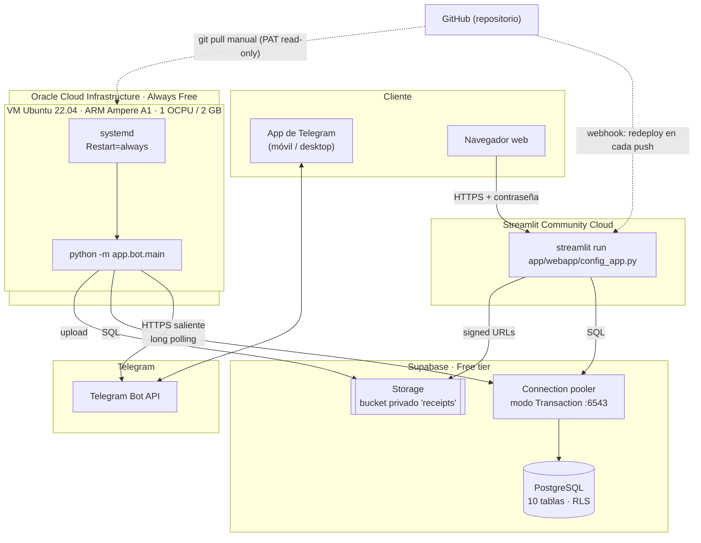

**Puntos clave de la topología**

- **El bot no expone ningún puerto.** Usa *long polling*: es él quien
  consulta a Telegram por HTTPS saliente. No necesita dominio, certificado
  TLS ni IP de entrada; el único ingress abierto en la VM es SSH,
  restringido a una sola IP.
- **Bot y dashboard son procesos independientes** en proveedores distintos.
  Reiniciar uno no afecta al otro. Se comunican solo a través de la base de
  datos (patrón *shared database*), lo cual es suficiente con un único
  usuario y sin requisitos de tiempo real.
- **Las fotos no pueden ir a disco local**: la VM del bot y el contenedor de
  Streamlit no comparten filesystem, así que ambos hablan con el mismo
  bucket de Supabase Storage.

## 4. Arquitectura en capas del código

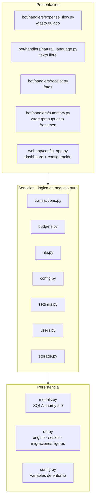

**Regla de dependencias:** los handlers del bot y el dashboard solo llaman a
`app/services/`; ningún servicio importa nada de Telegram ni de Streamlit.
Consecuencias prácticas:

- Una regla de negocio (por ejemplo, cómo se calcula el estado de un
  presupuesto) se implementa **una vez** y la usan las dos interfaces.
- Los servicios se testean con una sesión SQLite en memoria, sin simular
  Telegram ni Streamlit.
- Agregar una tercera interfaz (API REST, CLI) no requeriría tocar la lógica.

**Gestión de sesión.** `db.get_session()` es un *context manager* que hace
`commit` al salir sin error y `rollback` ante cualquier excepción: cada
acción del usuario es una unidad de trabajo atómica. La sesión usa
`expire_on_commit=False` porque los handlers siguen leyendo atributos de
los objetos después del commit para armar el mensaje de respuesta.

**Motor intercambiable.** `DATABASE_URL` decide el motor:
`sqlite:///./finanzas.db` en desarrollo, Postgres en producción.
`db._make_engine()` ajusta los `connect_args` según el caso (ver
[§13.1](#131-prepared-statements-y-el-pooler-de-supabase)).

## 5. Modelo de datos

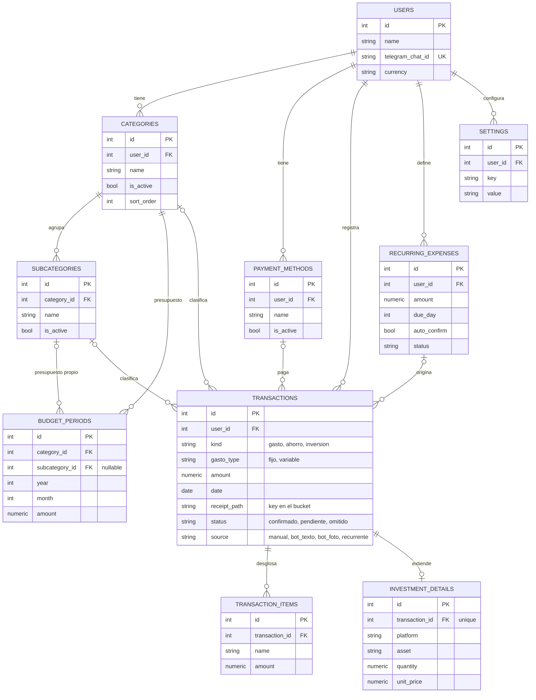

**Decisiones de modelado**

| Decisión | Alternativa descartada | Motivo |
|---|---|---|
| Tabla central `transactions` + tablas de extensión (`transaction_items`, `investment_details`) | Una tabla por tipo de movimiento, o una tabla gigante con todas las columnas | Consultas de "todo lo que salió este mes" en una sola tabla, sin columnas vacías para casos raros |
| Valores permitidos (`kind`, `status`, `source`…) validados en la capa de servicios | `ENUM` de base de datos | Mismo código en SQLite y Postgres; agregar un valor no requiere migración |
| Montos en `Numeric(12, 2)` y `Decimal` en Python | `float` | Sin errores de redondeo en dinero |
| `user_id` en todas las tablas desde el día uno | Esquema mono-usuario | Costo casi nulo hoy; evita rediseñar si se vuelve multiusuario |
| `settings` como clave-valor | Una columna por ajuste | Agregar un ajuste nuevo no requiere migración |
| Categorías con `is_active` y borrado bloqueado si tienen movimientos | Borrado en cascada | Nunca se pierde histórico por accidente |

## 6. Flujos del bot de Telegram

### 6.1 Orden de despacho de mensajes

El orden en que se registran los handlers (`app/bot/main.py`) define quién
atiende cada mensaje. Antes que todos corre el control de acceso
(`app/bot/access.py`, grupo -1):

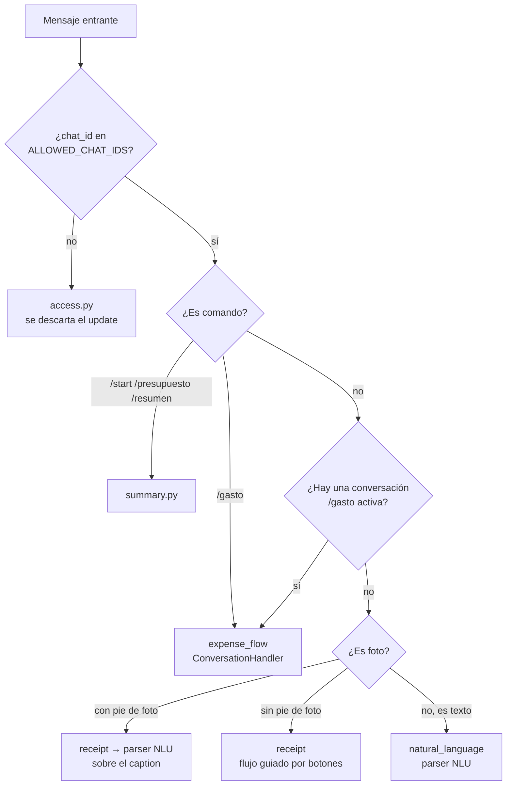

`expense_flow` se registra antes que el handler de texto libre: mientras una
conversación `/gasto` está activa, el `ConversationHandler` intercepta los
mensajes y el parser de lenguaje natural nunca los ve.

### 6.2 Registro por texto libre

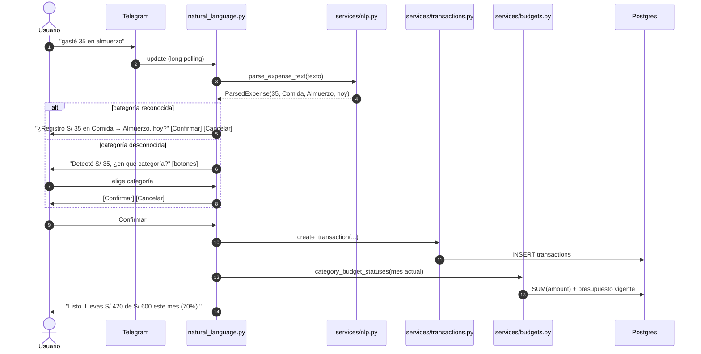

El estado pendiente (monto, fecha, categoría, foto) vive en
`context.user_data` entre mensajes, y se limpia siempre en el `finally` del
guardado — una confirmación vieja no puede registrar dos veces el mismo
gasto.

### 6.3 Registro con foto de comprobante

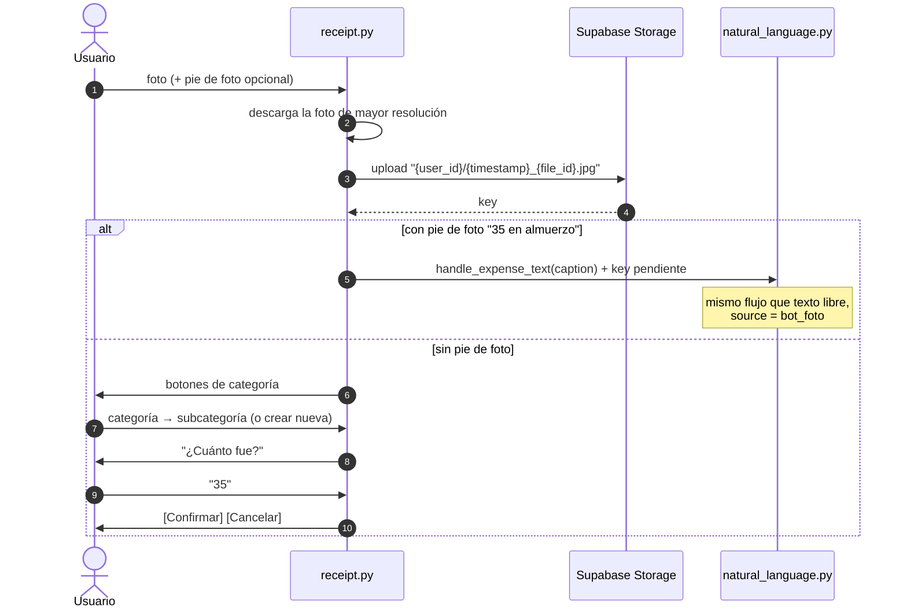

Sin pie de foto, el flujo es **100 % guiado** a propósito: en una versión
anterior, la respuesta a "¿cuánto fue?" (por ejemplo *"120 en el
gimnasio"*) pasaba por el parser de palabras clave y podía disparar una
categoría equivocada por coincidencia. Separar los caminos eliminó esa clase
de error.

### 6.4 Máquina de estados de `/gasto`

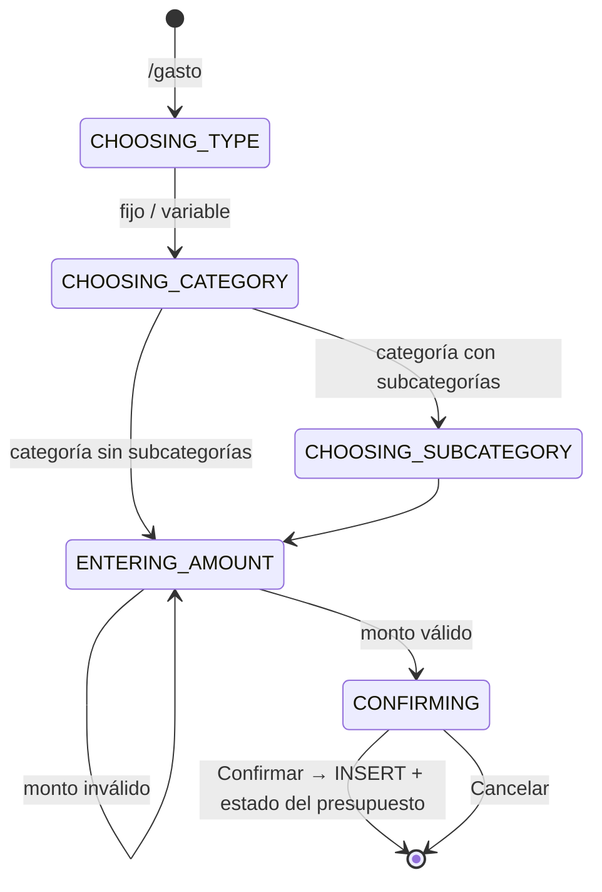

Implementado con `ConversationHandler` de `python-telegram-bot`: cada
estado acepta solo el tipo de interacción esperado (un `CallbackQuery` con
un prefijo concreto, o texto), así que un toque en un botón viejo de otra
conversación no avanza el flujo equivocado.

## 7. Lógica de negocio destacada

### 7.1 Parser de lenguaje natural sin IA (`services/nlp.py`)

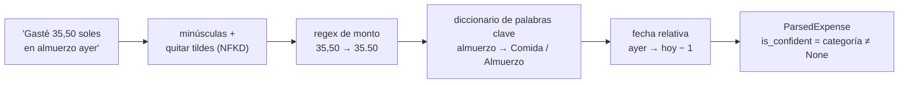

- Reconoce montos con coma o punto decimal y sufijos `soles`, `sol`, `S/`.
- Las palabras clave se buscan con límites de palabra (`\b`) para evitar
  falsos positivos ("bar" no coincide dentro de "barato").
- Si no hay monto devuelve `None` (no hay nada que registrar); si no hay
  categoría, el bot **pregunta** en vez de adivinar.

**Por qué no un LLM:** para frases de 4–6 palabras, una regex y un
diccionario resuelven el caso real con costo cero, latencia de
microsegundos, resultados reproducibles y tests triviales. La IA se reserva
para donde sí aporta: leer el comprobante (OCR), en la fase 2.

### 7.2 Presupuestos *carry-forward* (`services/budgets.py`)

No se guarda una fila por mes. `budget_periods` solo recibe una fila cuando
el monto **cambia**, y ese monto rige desde ese mes hasta el siguiente
cambio:

| Mes | Fila en `budget_periods` | Presupuesto vigente de "Comida" |
|---|---|---|
| Enero | `(2026, 1, 600)` | S/ 600 |
| Febrero | — | S/ 600 *(heredado de enero)* |
| Marzo | — | S/ 600 *(heredado de enero)* |
| Abril | `(2026, 4, 700)` | S/ 700 |
| Mayo en adelante | — | S/ 700 *(heredado de abril)* |

`resolve_budget(year, month)` devuelve la fila más reciente con
`(year, month) ≤ objetivo`. Ventajas:

- **El histórico es inmutable**: subir el presupuesto en abril no cambia
  cuánto se tenía disponible en febrero, así que los reportes de meses
  pasados siguen siendo correctos.
- **Cero mantenimiento**: no hace falta un job que "copie" presupuestos cada
  primer día del mes.
- Categoría y subcategoría tienen presupuestos **independientes**
  (`subcategory_id` nulo = presupuesto de la categoría).

### 7.3 Presupuesto completo vs. prorrateado

Dos funciones para dos preguntas distintas:

| Función | Pregunta que responde | Ejemplo (presupuesto S/ 600, 30 días) |
|---|---|---|
| `full_budget_for_range` | "¿Cómo voy este mes?" | Del 1 al 5: disponible contra **S/ 600** |
| `prorated_budget_for_range` | "¿Cuánto me correspondía en este rango?" | Una semana: **S/ 140** (600 × 7/30) |

El prorrateo recorre el rango mes a mes, así que un rango que cruza dos
meses con presupuestos distintos se calcula correctamente.

### 7.4 Umbrales de alerta configurables

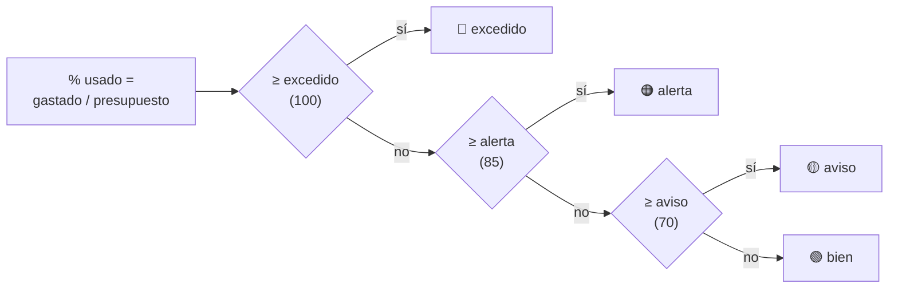

Los tres umbrales se leen de la tabla `settings` (valores por defecto 70 /
85 / 100) y se editan desde el panel.

## 8. Dashboard y panel de configuración

Una sola app de Streamlit (`app/webapp/config_app.py`) organizada en
pestañas:

| Pestaña | Contenido |
|---|---|
| Dashboard | Selector de rango (hoy, semana, mes, año, personalizado); KPIs: total, fijo, variable, promedio diario; gasto por categoría (barras o pastel); fijo vs. variable; evolución temporal con granularidad automática (día / mes / año según el largo del rango); tabla de movimientos |
| Categorías | Crear, renombrar, activar/desactivar, eliminar (bloqueado si hay movimientos), mover subcategorías entre categorías |
| Comprobantes | Galería de fotos filtrable por categoría, subcategoría y fechas (URLs firmadas de 1 hora) |
| Presupuestos | Montos por categoría y subcategoría, con historial |
| Métodos de pago | Alta y activación |
| Ajustes | Ingreso mensual y umbrales de alerta |

**Detalles de implementación que no son obvios**

- **Streamlit Cloud entrega la configuración como `st.secrets`**, pero
  `app/config.py` lee con `os.getenv`. Al arrancar, el dashboard vuelca
  `st.secrets` a `os.environ` *antes* de importar `app`: el mismo código
  funciona con `.env` local, con `systemd` y con Streamlit Cloud.
- **`st.rerun()` nunca se llama dentro de `with get_session()`**:
  `st.rerun()` corta la ejecución lanzando una excepción interna; dentro del
  `with`, eso dispararía el `rollback` y el cambio se perdería en silencio.
  El patrón es cerrar la sesión (commit) y recién después hacer el rerun.
- **`sys.path`**: `streamlit run` solo agrega la carpeta del script, así que
  el archivo inserta la raíz del proyecto para poder importar `app.*`.

## 9. Infraestructura y despliegue

### 9.1 Por qué cada proveedor

| Necesidad | Elegido | Por qué no la alternativa habitual |
|---|---|---|
| Proceso 24/7 para el bot | **Oracle Cloud Always Free** (VM ARM) | Render/Railway free (duermen o tienen horas limitadas); PC local (no es 24/7) |
| Postgres + almacenamiento de archivos | **Supabase** | Neon (sin storage de archivos); SQLite en la VM (el dashboard no podría leerlo) |
| Hosting del dashboard | **Streamlit Community Cloud** | Correrlo en la misma VM (2 GB de RAM justos; exigiría exponer un puerto y gestionar TLS) |

### 9.2 Pipeline de despliegue

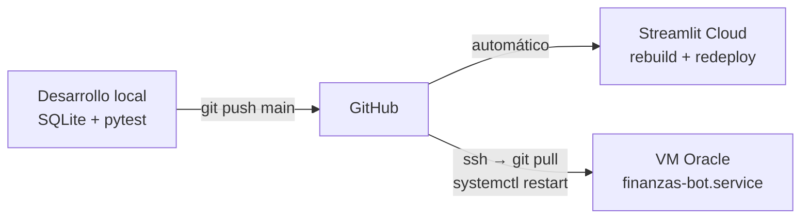

- **Dashboard:** despliegue continuo; cada push a `main` lo reconstruye.
- **Bot:** despliegue manual en dos comandos (el bot no tiene recarga en
  caliente). La VM clona el repo con un token de GitHub de solo lectura.

### 9.3 Resiliencia del bot

La unidad `systemd` ([`deploy/finanzas-bot.service`](../deploy/finanzas-bot.service))
usa `Restart=always` + `RestartSec=5` y está `enabled`:

- Si el proceso cae (error no capturado, corte de red), vuelve en 5 s.
- Si la VM se reinicia, el servicio arranca con el sistema — verificado con
  un `reboot` real.
- `systemd` garantiza **un único proceso**: en desarrollo local, dos
  instancias del bot con el mismo token se reparten los updates de Telegram
  y producen respuestas intermitentes con código viejo.

La VM tiene 2 GB de RAM más 2 GB de swap como colchón; el bot usa ~55 MB.
Solo se instala el subconjunto de dependencias del bot (sin Streamlit,
pandas ni altair).

## 10. Seguridad

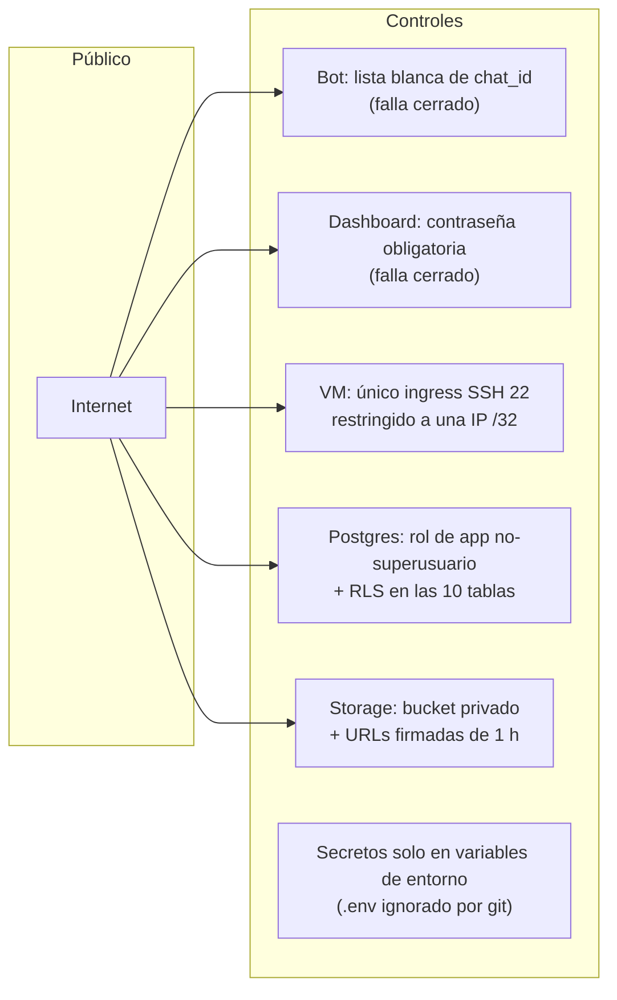

| Riesgo | Mitigación |
|---|---|
| Bot de Telegram accesible por cualquiera que encuentre su usuario | `ALLOWED_CHAT_IDS`: un handler en el grupo -1 descarta todo update de un chat no autorizado antes de que llegue a la lógica. **Falla cerrado**: con la lista vacía no se registra nada; el bot solo responde con el `chat_id` para facilitar la configuración inicial. Con la lista configurada, los desconocidos no reciben respuesta |
| Dashboard público en Streamlit Cloud | `DASHBOARD_PASSWORD` obligatoria. **Falla cerrado**: si la variable no existe, la app no muestra nada en lugar de quedar abierta |
| Credencial de base de datos filtrada | La app conecta con un rol propio (`NOSUPERUSER NOCREATEDB NOCREATEROLE`) dueño solo de sus tablas, no con el superusuario del proyecto |
| Acceso a tablas vía la API REST de Supabase | RLS activado sin políticas: cualquier rol distinto del dueño (p. ej. `anon`) queda denegado por defecto |
| Fotos de comprobantes expuestas | Bucket privado; el dashboard genera URLs firmadas que expiran en 1 hora |
| Acceso a la VM | Sin puertos de aplicación abiertos (el bot usa polling saliente); SSH solo con clave y desde una IP |
| Secretos en el repositorio | `.env`, `*.key`, `*.pem`, `.streamlit/` en `.gitignore`; `.env.example` solo con marcadores |
| Deriva de dependencias | `requirements-lock.txt` con versiones exactas del entorno probado |

**Riesgo aceptado:** bot y dashboard comparten la `service_role` key de
Supabase para Storage. Acotarla exigiría rearquitecturar el acceso con la
`anon` key y políticas RLS del bucket — un esfuerzo desproporcionado para
una app personal de un solo usuario.

## 11. Estrategia de testing

- **42 tests** con `pytest` sobre la capa de servicios, que concentra la
  lógica: presupuestos y prorrateo, alta y validación de movimientos, CRUD
  de configuración, ajustes y parser NLP.
- Cada test recibe una **base SQLite en memoria nueva** (`tests/conftest.py`):
  aislamiento total, ejecución en segundos, sin token de Telegram, sin
  internet y sin Supabase.
- La arquitectura en capas es lo que lo hace posible: como los servicios no
  dependen de Telegram ni de Streamlit, no hace falta simular ninguno.

| Archivo | Cubre |
|---|---|
| `test_budgets.py` | carry-forward, meses pasados inmutables, prorrateo, presupuesto de mes completo a mitad de mes, subcategorías independientes, umbrales |
| `test_transactions.py` | alta básica y con comprobante, validaciones (monto, categoría), desglose que debe sumar el total, filtros por rango, categoría, subcategoría y comprobante |
| `test_config.py` | CRUD de categorías, subcategorías y métodos de pago, nombres duplicados, desactivar conservando histórico, borrado bloqueado con movimientos, upsert de presupuestos |
| `test_settings.py` | valores por defecto, sobrescritura, sembrado inicial que no pisa valores existentes |
| `test_nlp.py` | monto y categoría, decimal con coma, categoría desconocida, sin monto, fechas relativas "ayer" y "anteayer" |
| `test_access.py` | parseo de `ALLOWED_CHAT_IDS` (vacío, negativos, inválido) y decisión de acceso |

## 12. Limitaciones y roadmap

**Limitaciones conocidas**

- El registro por texto y por foto guarda siempre el gasto como *variable*.
- `RecurringExpense` existe en el modelo, pero aún no hay un job que genere
  el borrador mensual.
- `/ahorro` e `/inversion` aún no existen como comandos (el modelo ya los
  soporta).
- Migraciones: `init_db()` agrega columnas nuevas automáticamente
  (`ALTER TABLE ... ADD COLUMN`), pero no renombra ni borra; no hay Alembic.
- El tier gratuito de Supabase pausa el proyecto tras varios días sin
  actividad.

**Roadmap**

| Fase | Elemento |
|---|---|
| Corto plazo | Job de gastos recurrentes (`JobQueue` de python-telegram-bot); comandos `/ahorro` e `/inversion`; inferir fijo/variable por categoría; ping diario para evitar la pausa de Supabase |
| Fase 2 | OCR del comprobante con un modelo de visión (monto, comercio, fecha); Alembic; login multiusuario (el esquema ya tiene `user_id`) |
| Fase 3 | Comparativas mes a mes, detección de anomalías, proyección de fin de mes; notificaciones proactivas del bot |

## 13. Retos técnicos resueltos

### 13.1 Prepared statements y el pooler de Supabase

**Síntoma:** la primera consulta contra Postgres funcionaba y la segunda
fallaba con `prepared statement "..." already exists`.

**Causa:** el *connection pooler* de Supabase en modo *Transaction*
reasigna la conexión física de Postgres entre clientes en cada transacción.
psycopg 3 crea *prepared statements* con nombre en el servidor; al volver a
una conexión física donde otro cliente ya creó uno con el mismo nombre,
colisionan.

**Solución:** `db._make_engine()` detecta el host del pooler y pasa
`connect_args={"prepare_threshold": None}`, que desactiva los prepared
statements del lado del servidor (la configuración recomendada para ese
modo).

### 13.2 Python 3.14 en Streamlit Community Cloud

**Síntoma:** el dashboard fallaba al importar `altair` en la nube, pero no en
local.

**Causa:** la plataforma usa por defecto la última versión de Python, y
`altair` 5.5 es incompatible con un cambio en `TypedDict` de 3.14.

**Solución:** `runtime.txt` fija Python 3.12 para el dashboard.

### 13.3 Una contraseña con `@` rompía la URL de conexión

**Síntoma:** `failed to resolve host 'xxx@host...'` al arrancar el bot.

**Causa:** la contraseña contenía `@`, que en una URL separa las
credenciales del host; el parser cortaba en el lugar equivocado.

**Solución:** rotar a una contraseña alfanumérica y propagarla a los tres
entornos (local, VM, Secrets de Streamlit). Alternativa válida: codificar la
contraseña (`@` → `%40`).

### 13.4 Configuración unificada en tres entornos

Local (`.env`), VM (`.env` + `systemd`) y Streamlit Cloud (`st.secrets`)
entregan la configuración de formas distintas. Se resolvió con **un único
punto de lectura** (`app/config.py`, basado en `os.getenv`) y un adaptador
de 5 líneas en el dashboard que vuelca `st.secrets` a variables de entorno.

### 13.5 `st.rerun()` y transacciones perdidas en silencio

**Riesgo:** `st.rerun()` interrumpe el script lanzando una excepción
interna. Si se llama dentro de `with get_session()`, el context manager la
trata como un error, hace `rollback` y el cambio del formulario se pierde
sin ningún mensaje.

**Solución:** convención documentada al inicio de `config_app.py` y
aplicada en todo el panel: terminar el bloque de sesión (commit) y solo
después llamar a `st.rerun()`.

### 13.6 Oracle Cloud: capacidad y shape

El shape ARM gratuito (`VM.Standard.A1.Flex`) no tenía capacidad en la
primera región probada, y el shape AMD micro gratuito no existe en regiones
nuevas. Se usó una región con capacidad disponible y se verificó que todas
las dependencias del bot tienen *wheels* `aarch64` precompiladas, así que
ARM no supuso ninguna compilación en la VM.

## 14. Lecciones aprendidas

- **Lo simple primero.** Una regex resolvió el 100 % del lenguaje natural
  que realmente se usa; un LLM habría añadido costo, latencia y no
  determinismo sin beneficio.
- **Separar negocio de interfaz paga desde el primer día**: dos interfaces,
  una sola implementación de las reglas, y tests sin mocks.
- **Diseñar el histórico como inmutable** (presupuestos carry-forward) evita
  una categoría entera de bugs de reportes.
- **Fallar cerrado** en seguridad: una variable de entorno olvidada debe
  bloquear la app, no dejarla abierta.
- **Las capas gratuitas tienen letra pequeña** (pausa por inactividad,
  shapes por región, versión de Python por defecto); vale la pena
  documentarla junto al código.
