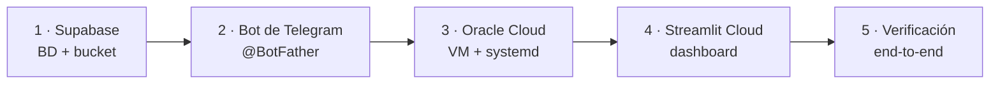

# Guía de despliegue — Finanzas_Gestor

Cómo reproducir el despliegue completo en capas gratuitas: **Supabase**
(Postgres + Storage), **Oracle Cloud Always Free** (bot 24/7) y **Streamlit
Community Cloud** (dashboard). Todos los valores entre `<…>` son marcadores
de posición.



## Variables de entorno

Las mismas variables en los tres entornos (ver [`.env.example`](../.env.example)):

| Variable | Bot (VM) | Dashboard | Descripción |
|---|:-:|:-:|---|
| `DATABASE_URL` | ✅ | ✅ | `postgresql+psycopg://<usuario>:<password>@<host-del-pooler>:6543/postgres` |
| `TELEGRAM_BOT_TOKEN` | ✅ | — | Token de @BotFather |
| `ALLOWED_CHAT_IDS` | ✅ | — | `chat_id` autorizados, separados por coma (ver §3.4) |
| `SUPABASE_URL` | ✅ | ✅ | `https://<ref-del-proyecto>.supabase.co` |
| `SUPABASE_SERVICE_ROLE_KEY` | ✅ | ✅ | Clave `service_role` (nunca en git) |
| `SUPABASE_RECEIPTS_BUCKET` | ✅ | ✅ | `receipts` |
| `DASHBOARD_PASSWORD` | — | ✅ | Contraseña de acceso al panel (obligatoria) |
| `DEFAULT_CURRENCY` | opcional | opcional | `PEN` por defecto |

> ⚠️ Si la contraseña de Postgres tiene caracteres especiales (`@ : / # %`),
> hay que codificarlos en la URL (`@` → `%40`, etc.) o usar una contraseña
> alfanumérica.

---

## 1. Supabase

1. Crear un proyecto en [supabase.com](https://supabase.com) (plan Free).
2. **Connection string:** *Connect → Transaction pooler* (puerto **6543**).
   Cambiar el esquema a `postgresql+psycopg://`. `app/db.py` detecta el
   host `pooler.supabase.com` y desactiva los *prepared statements*, que
   este modo no soporta.
3. **Storage:** crear un bucket **privado** llamado `receipts`.
4. *(Recomendado)* **Rol de mínimo privilegio para la app**, desde el SQL
   Editor:

   ```sql
   CREATE ROLE finanzas_app LOGIN PASSWORD '<password-fuerte>'
     NOSUPERUSER NOCREATEDB NOCREATEROLE NOREPLICATION;
   GRANT USAGE, CREATE ON SCHEMA public TO finanzas_app;
   ```

   Usar ese rol en `DATABASE_URL`. La app crea sus tablas en el primer
   arranque y queda como dueña de ellas.
5. *(Recomendado)* Tras el primer arranque, **activar RLS** en las tablas de
   la app para que la API REST de Supabase (rol `anon`) no pueda leerlas:

   ```sql
   DO $$
   DECLARE t text;
   BEGIN
     FOREACH t IN ARRAY ARRAY['users','settings','categories','subcategories',
       'payment_methods','budget_periods','recurring_expenses','transactions',
       'transaction_items','investment_details']
     LOOP
       EXECUTE format('ALTER TABLE %I ENABLE ROW LEVEL SECURITY', t);
     END LOOP;
   END $$;
   ```

   El dueño de las tablas (`finanzas_app`) no se ve afectado. El *Security
   Advisor* marcará "RLS enabled, no policies": es intencional.
6. **Datos iniciales:** con `DATABASE_URL` apuntando a Supabase en un `.env`
   local, correr `python -m app.services.seed`.

## 2. Bot de Telegram

1. En Telegram, hablar con **@BotFather** → `/newbot` → guardar el token.
2. *(Opcional)* `/setcommands` para mostrar el menú:

   ```
   gasto - Registrar un gasto paso a paso
   presupuesto - Estado del presupuesto del mes
   resumen - Resumen del mes
   ```

## 3. Oracle Cloud — VM para el bot

### 3.1 Crear la VM

1. Cuenta en [Oracle Cloud Free Tier](https://www.oracle.com/cloud/free/).
   Los recursos *Always Free* solo existen en la **home region**, que no se
   puede cambiar después del registro.
2. **Red:** *Networking → Virtual Cloud Networks → Start VCN Wizard →
   Create VCN with Internet Connectivity*. Crear la red así (y no desde el
   formulario de la instancia) garantiza una subred pública con Internet
   Gateway.
3. **Instancia:** *Compute → Instances → Create*:
   - Imagen: **Canonical Ubuntu 22.04** (variante `aarch64`).
   - Shape: **`VM.Standard.A1.Flex`**, 1 OCPU / 2 GB (Always Free).
   - Red: la VCN y subred pública del paso anterior, con IPv4 pública.
   - SSH: generar o subir un par de claves y **guardar la clave privada**.
4. **Endurecer SSH:** en la *Security List* de la VCN, cambiar el origen de
   la regla TCP 22 de `0.0.0.0/0` a `<tu-ip>/32`. El bot no necesita ningún
   otro puerto de entrada.

### 3.2 Preparar el sistema

```bash
ssh -o ServerAliveInterval=60 -i <ruta-a-la-clave-privada> ubuntu@<ip-publica>

sudo apt update && sudo apt -y upgrade
sudo apt -y install python3-venv python3-pip git
sudo timedatectl set-timezone America/Lima   # la zona horaria define "hoy" para los gastos

# Swap de 2 GB como colchón para los 2 GB de RAM
sudo fallocate -l 2G /swapfile && sudo chmod 600 /swapfile
sudo mkswap /swapfile && sudo swapon /swapfile
echo '/swapfile none swap sw 0 0' | sudo tee -a /etc/fstab
```

### 3.3 Código y dependencias

```bash
git clone https://github.com/<usuario>/<repo>.git ~/Finance
cd ~/Finance
python3 -m venv .venv && . .venv/bin/activate
pip install --upgrade pip

# Solo lo que usa el bot (sin streamlit/pandas/altair)
pip install "python-telegram-bot>=21,<22" "SQLAlchemy>=2.0,<3.0" \
            "python-dotenv>=1.0,<2.0" "psycopg[binary]>=3.1,<4.0" "supabase>=2.0,<3.0"
```

> Si el repositorio es privado, clonar con un *fine-grained token* de
> GitHub de **solo lectura** limitado a ese repositorio.

### 3.4 Configuración y prueba manual

```bash
nano ~/Finance/.env        # DATABASE_URL, TELEGRAM_BOT_TOKEN, SUPABASE_*
chmod 600 ~/Finance/.env

python -m app.bot.main     # debe imprimir "Bot corriendo..."
```

**Autorizar tu chat:** con `ALLOWED_CHAT_IDS` vacío, escríbele cualquier
cosa al bot: no registrará nada y te responderá con tu `chat_id`. Agrégalo
al `.env` (`ALLOWED_CHAT_IDS=<tu_chat_id>`), detén el bot con Ctrl+C,
vuelve a arrancarlo y prueba `/start`. Para autorizar más de un chat,
sepáralos con comas.

### 3.5 Servicio `systemd`

```bash
sudo cp ~/Finance/deploy/finanzas-bot.service /etc/systemd/system/
sudo systemctl daemon-reload
sudo systemctl enable --now finanzas-bot
systemctl status finanzas-bot --no-pager
```

Verificar la resiliencia con `sudo reboot`: al volver, `systemctl
is-active finanzas-bot` debe responder `active` sin intervención.

## 4. Streamlit Community Cloud — dashboard

1. En [share.streamlit.io](https://share.streamlit.io): *Create app* →
   repositorio, rama `main`, archivo principal `app/webapp/config_app.py`.
2. *Advanced settings → Secrets* (formato TOML):

   ```toml
   DATABASE_URL = "postgresql+psycopg://<usuario>:<password>@<host-del-pooler>:6543/postgres"
   SUPABASE_URL = "https://<ref-del-proyecto>.supabase.co"
   SUPABASE_SERVICE_ROLE_KEY = "<service-role-key>"
   SUPABASE_RECEIPTS_BUCKET = "receipts"
   DASHBOARD_PASSWORD = "<contraseña-del-panel>"
   ```

3. `runtime.txt` ya fija Python 3.12 (la versión por defecto de la
   plataforma es incompatible con `altair` 5.5).
4. Deploy. Cada `git push` a `main` redespliega automáticamente.

## 5. Verificación end-to-end

- [ ] `/start` en Telegram responde desde tu chat.
- [ ] Desde otra cuenta de Telegram, el bot no responde ni registra nada.
- [ ] "gasté 10 en almuerzo" → confirmar → el bot informa el estado del presupuesto.
- [ ] Una foto con pie de foto queda registrada con comprobante.
- [ ] El dashboard pide contraseña y, tras ingresarla, muestra ambos gastos.
- [ ] La foto aparece en la pestaña *Comprobantes*.
- [ ] Tras `sudo reboot` de la VM, el bot vuelve a responder solo.

## Operación diaria

| Tarea | Comando / lugar |
|---|---|
| Estado del bot | `systemctl status finanzas-bot` |
| Logs en vivo | `journalctl -u finanzas-bot -f` |
| Desplegar código nuevo en el bot | `cd ~/Finance && git pull && sudo systemctl restart finanzas-bot` |
| Tras editar `.env` | `sudo systemctl restart finanzas-bot` |
| Logs del dashboard | share.streamlit.io → *Manage app* → *Logs* |
| Cambiar Secrets del dashboard | *Manage app* → *Settings* → *Secrets* → *Reboot app* |

## Problemas frecuentes

| Síntoma | Causa | Solución |
|---|---|---|
| `prepared statement "..." already exists` | Conexión al pooler en modo Transaction sin desactivar prepared statements | Usar el host `*.pooler.supabase.com` (lo detecta `app/db.py`) |
| `failed to resolve host '…@…'` | Carácter especial sin codificar en la contraseña | Codificar (`%40`) o usar una contraseña alfanumérica |
| El dashboard falla al importar `altair` | Python 3.14 en Streamlit Cloud | Mantener `runtime.txt` con `3.12` |
| El dashboard dice "DASHBOARD_PASSWORD no está configurado" | Falta el secret | Agregarlo en Secrets y reiniciar la app |
| El bot responde "no tiene ningún chat autorizado" | `ALLOWED_CHAT_IDS` vacío o no cargado | Agregar el `chat_id` al `.env` y reiniciar el servicio |
| El bot no responde nada (y el log dice "chat no autorizado") | Tu `chat_id` no está en la lista | Revisar el número en `.env` (los grupos tienen `chat_id` negativo) |
| Respuestas intermitentes o con código viejo | Dos procesos del bot con el mismo token | Dejar solo el servicio `systemd`; matar procesos locales |
| Bot y dashboard dejan de responder tras días sin uso | Supabase Free pausó el proyecto | Reactivarlo desde el panel de Supabase |
| SSH deja de conectar | Cambió tu IP pública (regla `/32`) o la IP efímera de la VM | Actualizar la *Security List* desde la consola web; reservar una IP pública si hace falta |
